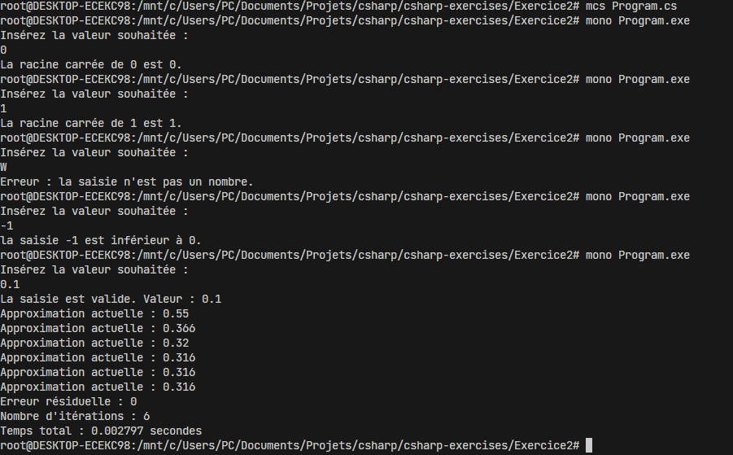

# C# Exercises

This project is a collection of exercises to be done in C#

COMMANDE A FAIRE A CHAQUE EXERCICE 
root@DESKTOP-ECEKC98:/mnt/c/Users/PC/Documents/Projets/csharp/csharp-exercises/Exercice1# mcs Program.cs
root@DESKTOP-ECEKC98:/mnt/c/Users/PC/Documents/Projets/csharp/csharp-exercises/Exercice1# mono Program.exe

## Exercice 1
- Vérifier que l'échange d'une variable de type Value doive se faire avec le modificateur **ref**.
- Vérifier que l'échange se fait simplement avec une sémantique VT:  tmp=A;A=B; …
- Prendre conscience que par défaut, à l'inverse du C, dans une structure tout est **private**.
- Plutôt redéfinir la méthode .ToString() que créer une nouvelle méthode (Afficher(), Display(), …) car c'est la méthode standard et par son retour qui permet la concaténation, la sérialisation, … et l'affichage aussi bien sûr. Plus d'explications ici: https://openclassrooms.com/forum/sujet/methode-tostring-vs-afficher 
Fait
## Exercice 2
- Apprendre à utiliser un objet  *StopWatch* ou *DateTime*
- Tester saisie et calcul avec 'W' (pas de crash?), -1 (pas de calcul?), 0 ou 1 (affichage), (0.1)-->0.31 calcul correct de l'erreur (valeur absolue ? 1027 
Fait

## Exercice 3
- Apprendre à désérialiser avec la classe *StreamReader* et les méthodes Read… 
- On peut aussi utiliser un **using** pour débloquer le fichier à la fin de la lecture
- Pour ceux qui sont attentifs ou qui le savent déjà utilisation de StringBuilder préférable

## Exercice 4
- Trouver un moyen de renvoyer deux valeurs: 
- **Tuple< T1, T2>** , (int[], int[] ) SwapF(…),  jagged Array[][], **ref List**, **ref int[]** …
- Attention, si on utilise des tableaux, il faut qu'ils contiennent le bon nombre d'éléments (pas [20]). Soit grâce à .ToArray() à partir d'une liste soit en comptant les nombres pair ou impair et instanciant les tableaux appropriés

## Exercice 5
- Le but de l'exercice est de se rendre compte du caractère **immuable** d'un objet String. On pourrait compléter par un profiling ou mesure de performance d'édition répétée d'un objet String, vs un Stringbuilder.
- On peut aussi vérifier si les étudiants pensent à factoriser l'appel des 9 méthodes répété 2x.
- Voir notion de **String_interning** (ou Flyweight DP)
- Attention donc, à ne pas construire "lettre par lettre" une phrase avec un objet string (+=). Toujours utiliser **StringBuilder**.